# Integración Google Drive - CondoManager SaaS

Esta documentación detalla la integración de Google Drive para el almacenamiento de documentos por condominio (Tenant) en CondoManager.

## 1. Contexto y Decisión Arquitectónica

La arquitectura actual es **Multi-Tenant**. Cada condominio es una entidad aislada que necesita su propio repositorio de documentos.
Para evitar costos iniciales elevados (AWS S3) y facilitar la adopción, se utiliza **Google Drive** como backend de almacenamiento.

### Estrategia de Almacenamiento
- **Modelo:** "Bring Your Own Drive" (parcialmente) o "Centralized Drive with Folders".
- **Flujo:** El Administrador del Condominio autoriza a la aplicación CondoManager a acceder a su Google Drive (o al Drive oficial del condominio).
- **Aislamiento:** Se crea una carpeta raíz única para el condominio usando su código o nombre.
- **Persistencia:** No se guardan archivos binarios en la base de datos ni en el servidor. Se guardan **IDs de archivo** y **Links de visualización**.

## 2. Flujo de Autenticación (OAuth 2.0)

El flujo utiliza OAuth 2.0 con el scope `drive.file` (acceso solo a archivos creados por la app) para mayor seguridad, o `drive` completo si se requiere gestión total.

### Diagrama de Secuencia (Lógica)

```mermaid
sequenceDiagram
    participant Admin as Administrador (Frontend)
    participant App as Backend (Flask)
    participant Google as Google Auth Server
    participant DB as Base de Datos

    Admin->>App: Click "Conectar Google Drive"
    App->>Google: Redirige a OAuth Consent Screen
    Google->>Admin: Pide permiso (offline access)
    Admin->>Google: Autoriza
    Google->>App: Callback con Auth Code
    App->>Google: Intercambia Code por Access Token + Refresh Token
    Google->>App: Tokens
    App->>Google: Crear Carpeta Raíz (Nombre del Condominio)
    App->>Google: Crear Subcarpetas (Actas, Contratos, etc.)
    App->>DB: Guardar Refresh Token, Root ID y Folder IDs
    App->>Admin: Confirmación "Conectado Exitosamente"
```

## 3. Estructura de Carpetas

Al conectar, se crea automáticamente la siguiente jerarquía:

- **[CÓDIGO CONDOMINIO] - [NOMBRE CONDOMINIO]** (Carpeta Raíz)
  - 📄 Actas
  - 📢 Convocatorias
  - 📩 Circulares
  - 📤 Oficios
  - 📝 Memos
  - 📋 Reglamento
  - 💰 Gastos
  - ✍️ Contratos
  - 🏗️ Planos
  - 📸 Fotos
  - 📂 Otros

## 4. Variables de Entorno

Configurar en `.env` (local) y Variables de Railway (producción):

| Variable | Descripción | Ejemplo |
|----------|-------------|---------|
| `GOOGLE_CLIENT_ID` | ID de cliente OAuth de Google Console | `123...apps.googleusercontent.com` |
| `GOOGLE_CLIENT_SECRET` | Secreto del cliente OAuth | `GOCSPX-...` |
| `GOOGLE_REDIRECT_URI` | URL de callback (debe coincidir con Console) | `https://condomanager.vip/google_drive/callback` |

## 5. Seguridad

- **Refresh Token:** Se almacena en la base de datos. En un entorno de alta seguridad, este campo debería estar encriptado (Fernet/AES).
- **Scopes:** Se recomienda usar `https://www.googleapis.com/auth/drive.file` para que la app solo tenga acceso a lo que ella misma crea, reduciendo el riesgo si el token es comprometido.
- **Validación:** El backend verifica que el usuario sea Admin del condominio antes de iniciar el flujo OAuth.

## 6. Modelo de Datos (Extensión)

Se agregan los siguientes campos al modelo `Condominium`:

- `drive_root_folder_id` (String): ID de la carpeta raíz en Drive.
- `drive_folders_map` (JSON): Mapeo `{ "Actas": "ID_FOLDER_ACTAS", ... }`.
- `drive_refresh_token` (String): Token para obtener acceso offline sin loguear de nuevo.
- `drive_email` (String): Correo de la cuenta conectada (auditoría).

## 7. Uso del Servicio

El servicio `GoogleDriveService` expone métodos para:
- `connect_and_setup(auth_code)`: Canjea código y crea estructura.
- `upload_file(file_stream, filename, folder_category)`: Sube archivo a la subcarpeta correcta.
- `get_file_link(file_id)`: Obtiene link de visualización/descarga.

